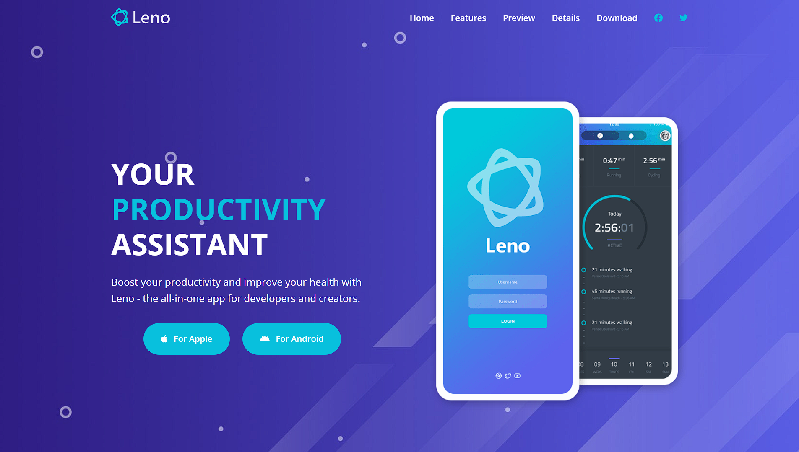
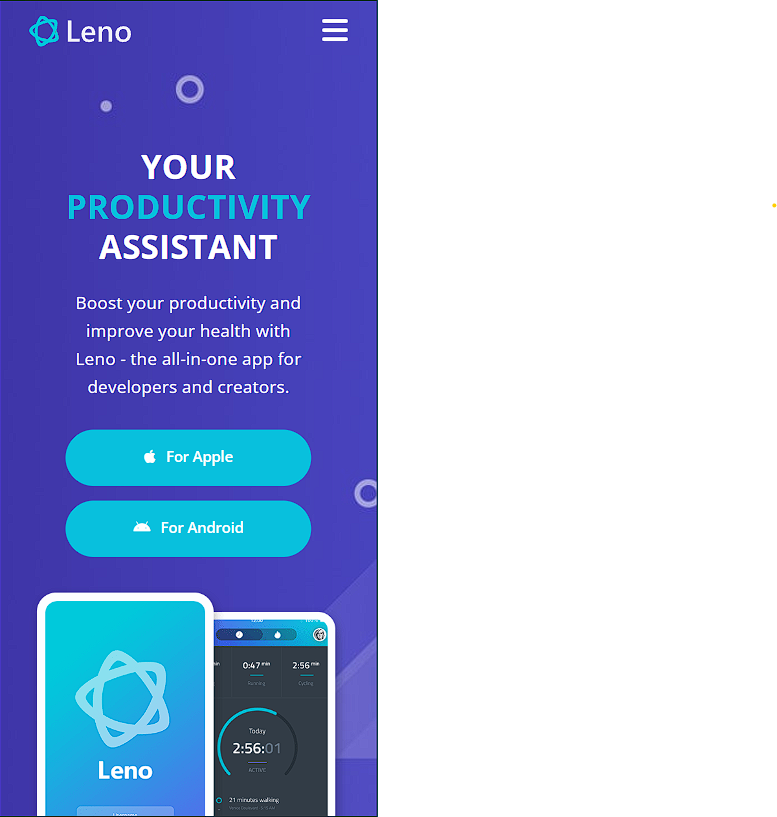

# **Leno - Landing Page**

Welcome to the **Leno** repository, a responsive website developed as part of my programming course. This project is a landing page for a fictitious mobile app, showcasing its features and offering a professional and elegant visual experience.

### 🌐 **Link to access the website**  
[**Leno**](https://lenoitalia.netlify.app/)

---

## 📋 **About the Project**
**Leno** is a project aimed at practicing web development skills. It uses **HTML**, **CSS**, and **JavaScript** to create a responsive and attractive landing page, designed to present a fictitious mobile app in a professional way.

### 🎯 **Features**
- **Responsive layout**, compatible with mobile devices, tablets, and desktops.
- Modern **UX/UI** design, inspired by landing pages of popular apps.
- Animations and dynamic interactions using **JavaScript**.
- Call-to-action buttons to engage users.

---

## 🚀 **Technologies Used**
- **HTML5**: Semantic and accessible structure.
- **CSS3**: Modern styling with responsive design.
- **JavaScript**: Dynamic and interactive features.
- **Swiper.js**: Library for creating customizable and responsive sliders.

---

## 🎨 **Project Preview**
Here are some screenshots of the project to give you an idea of its design and functionality:

### Desktop  


### Mobile  


---

## 📱 **Try it yourself!**
Explore the website at [**Leno**](https://lenoitalia.netlify.app/) and see how it adapts to your device.

---

## 🛠️ **How to run the project locally**
1. Clone this repository:  
   ```bash
   git clone https://github.com/your-username/leno-italia.git

2. Navigate to the cloned project folder:
     ```bash
   cd leno-italia
   ```
3. Open the index.html file
Use a browser of your choice to open the index.html file and view the project.

You can:

 - Drag the index.html file directly into the browser.

 - Use an extension like Live Server in VS Code to run the project on a local server.
